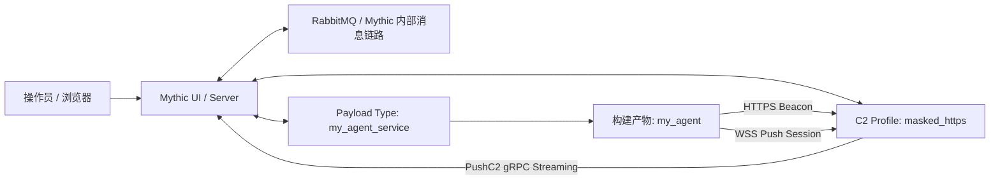
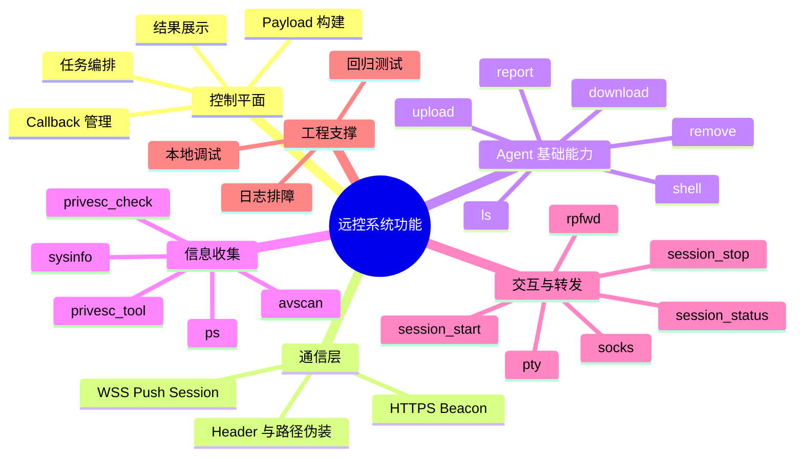
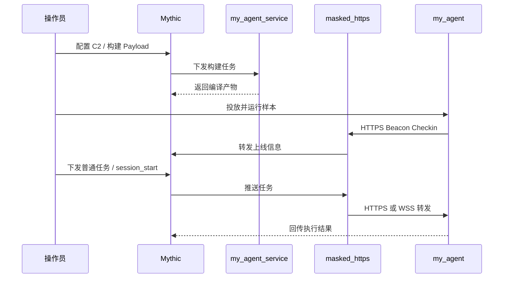

---
aliases:
  - ExampleContainers 技术方案
project: ExampleContainers
source_repo: /Users/zhujiayi/Documents/allMyCode/01_Work/ExampleContainers
template_doc: /Users/zhujiayi/Library/Containers/com.tencent.xinWeChat/Data/Documents/xwechat_files/wxid_veeamsyv9q2522_518f/msg/file/2026-04/技术方案-模版.docx
created: 2026-04-09
tags:
  - 技术方案
  - 毕业设计
  - Mythic
  - C2
---

# 基于 Mythic 框架的渗透测试远控系统技术方案

> 本方案基于当前仓库 `/Users/zhujiayi/Documents/allMyCode/01_Work/ExampleContainers` 的已实现内容整理，文档结构参考《技术方案-模版.docx》，重点覆盖当前已落地模块、部署方式与验证结果。

## 项目概述

- **项目名称**：基于 Mythic 框架的渗透测试远控系统
- **项目形态**：Mythic 扩展型工程项目
- **核心模块**：`my_agent_service`、`masked_https`、`my_agent`
- **当前定位**：面向实验/毕设场景的可扩展远控系统原型
- **代码位置**：`/Users/zhujiayi/Documents/allMyCode/01_Work/ExampleContainers`

---

## 1. 项目背景

随着攻防演练、渗透测试和安全研究对真实任务编排能力的要求不断提升，传统单体式远控工具逐渐暴露出扩展困难、通信链路僵化、平台耦合严重、验证成本高等问题。尤其在教学实验、毕业设计和工程化验证场景中，系统不仅要具备基础远控能力，还需要同时满足模块化设计、跨平台运行、通信链路可替换、能力可裁剪以及测试可复现等要求。

Mythic 作为现代化、容器化的 C2 框架，天然具备 Payload Type、C2 Profile、Webhook、任务调度与回调管理等扩展机制，适合作为实验型远控系统的控制平面。基于 Mythic 进行二次开发，可以避免从零搭建整套控制端框架，把研发重点集中在 Agent 设计、通信协议实现和能力模块化集成上。

当前项目围绕 Mythic 扩展开发，已经形成以下关键成果：

1. 实现了自定义 Payload Type：`my_agent_service`；
2. 实现了自定义 C2 Profile：`masked_https`；
3. 实现了 Go 语言编写的跨平台 Agent：`my_agent`；
4. 完成了 `HTTPS Beacon + WSS Push Session` 双模通信；
5. 已联调验证命令执行、文件管理、信息收集、PTY、SOCKS、RPFWD 等能力闭环。

因此，本项目具备整理为正式“技术开发方案”的基础，适合作为毕业设计或工程方案文档输出。

## 2. 系统总体设计

### 2.1 系统设计思路

本系统以“控制平面复用 + 通信链路定制 + Agent 能力模块化”为总体设计思路，重点强调以下几个方面：

1. **框架复用**：复用 Mythic 的任务编排、Payload 构建、回调管理与 UI 控制能力，降低控制端重复开发成本。
2. **双模通信**：将低频任务轮询与高频交互会话分离，Beacon 负责稳定上线与普通任务，Session 负责 PTY、SOCKS、RPFWD 等实时能力。
3. **统一配置嵌入**：通过 Builder 将运行参数打包为 Base64 JSON 后嵌入 Agent，减少散落环境变量带来的维护成本。
4. **模块化能力裁剪**：通过 Mythic 构建阶段的命令勾选决定最终样本能力，提升构建灵活性与实验可控性。
5. **跨平台支持**：以 Go 为主要实现语言，支持 macOS、Linux、Windows 三类目标系统构建，其中 macOS 与 Linux 已完成实际验证。
6. **可验证性优先**：方案不仅关注功能实现，也强调本地调试、端到端联调、浏览器侧操作和真实流量验证。

### 2.2 系统架构设计

系统整体由控制端、扩展容器、通信服务与目标端 Agent 四部分组成。控制端基于 Mythic，扩展层包括 Payload Type 与自定义 C2 Profile，目标端运行 Go Agent，三者共同构成完整的任务下发、执行与结果回传闭环。

从当前仓库的实现来看，系统数据流可概括为：

- **构建阶段**：`my_agent_service` 根据构建参数与 `masked_https` 的 C2 参数生成嵌入配置并编译产物；
- **上线阶段**：Agent 通过 HTTPS 完成初始 Beacon `checkin` 与普通任务轮询；
- **会话阶段**：当操作员执行 `session_start` 后，Agent 派生 WSS 长连接 Session callback；
- **推送阶段**：`masked_https` 通过 PushC2 gRPC 流将 Mythic 任务直接推送到在线 Session；
- **结果阶段**：Agent 将普通任务结果、交互输出、代理转发状态等信息回传 Mythic 平台。

### 2.3 系统设计原则

系统设计遵循如下原则：

1. **模块解耦原则**：Payload Type、C2 Profile 与 Agent 相互分工，便于替换与迭代；
2. **能力分层原则**：普通任务与交互任务分属 Beacon/Session 两条链路，降低职责混淆；
3. **工程可维护原则**：统一配置嵌入、命令按角色边界约束、目录结构清晰；
4. **可扩展原则**：支持新增命令、新增 Profile 参数或后续接入更多传输方式；
5. **跨平台原则**：Builder 支持多目标 OS/架构编译，减少平台依赖；
6. **可观测原则**：支持 Mythic 侧任务日志、服务日志和回归测试结果追踪；
7. **可验证原则**：强调真实浏览器操作、真实流量转发和端到端功能闭环验证。

### 2.4 系统技术路线

本项目采用“Go Agent + Mythic 扩展容器 + HTTPS/WSS 通信 + PushC2 实时推送 + Docker 化部署”的技术路线，具体如下：

| 层次 | 技术选型 | 说明 |
| --- | --- | --- |
| 控制平面 | Mythic | 提供任务、回调、构建与 UI 控制能力 |
| 消息链路 | RabbitMQ | 支撑 Payload Type 与 Mythic 间消息交互 |
| Payload Type | Go + MythicContainer v1.4.23 | 负责 Payload 构建、命令注册、配置注入 |
| C2 Profile | Go + HTTPS/WSS | 负责 Beacon 与 Session 通道接入 |
| Push 通道 | gRPC PushC2Streaming | 用于 Session 实时任务下推 |
| Agent | Go 1.23.x | 支持多平台静态编译与模块化能力集成 |
| 调试验证 | Mythic UI / 后端 RPC / 浏览器自动化 | 支持端到端验证和回归测试 |

其中，`masked_https` 并不是简单的单一 HTTP Profile，而是从同一组 C2 参数中派生出 `http` 与 `websocket` 两类嵌入配置，分别服务于 Beacon 与 Session 两条路径。

## 3. 系统技术特点

当前系统已经形成较明确的技术特征：

1. **单 Profile 双通道化设计**：以 `masked_https` 为统一入口，同时支撑 HTTPS Beacon 与 WSS Session；
2. **真 Push Session 架构**：Session 不再是伪流式封装，而是基于 PushC2Streaming 的真实推送链路；
3. **命令按回调角色隔离**：Beacon 负责 `shell`、`ls`、`upload`、`download`、`report` 等普通任务，Session 负责 `pty`、`socks`、`rpfwd` 等交互或转发任务；
4. **构建期能力裁剪**：命令集由 Mythic 构建参数控制，便于根据实验场景灵活生成不同能力组合；
5. **通信伪装能力**：支持 `post_path`、`websocket_path`、`user_agent`、`host_header` 和附加 Header 等参数配置；
6. **跨平台构建能力**：Builder 支持 `linux`、`macos`、`windows` 目标系统和 `amd64/arm64` 架构；
7. **完整功能闭环**：已完成 Beacon、Session、PTY、SOCKS、RPFWD 的真实回归验证，具备较好的方案落地性。

## 4. 系统功能设计

### 4.1 系统总体功能模块图

### 4.2 各个系统模块

#### （1）Payload 构建模块

该模块由 `Payload_Type/my_agent_service` 实现，主要负责：

- 向 Mythic 注册 `my_agent` Payload Type；
- 接收构建参数与命令列表；
- 检查是否选择了 `masked_https` C2 Profile；
- 按命令列表自动判断是否启用 Session Mode；
- 将 C2 参数和能力开关整理为统一嵌入配置；
- 调用 Go 编译器生成最终样本。

该模块是系统的“样本生成中心”，直接决定最终 Agent 的运行能力边界。

#### （2）Agent 运行时模块

该模块位于 `my_agent/agent_code`，是目标端核心运行时，主要包含：

- 启动入口与嵌入配置加载；
- Beacon 控制器与普通任务处理；
- Session 监督器与交互式会话管理；
- 文件操作、系统信息收集和结构化结果回传；
- 传输层封装（HTTP / WebSocket）。

运行时设计采用“控制器 + 能力模块”方式，便于后续继续新增命令。

#### （3）`masked_https` 通信模块

该模块位于 `C2_Profiles/masked_https`，主要职责包括：

- 注册自定义 C2 Profile；
- 接收 Mythic 下发的 C2 参数并同步到服务端配置；
- 暴露 Beacon 的 HTTPS 接口与 Session 的 WSS 接口；
- 建立 Agent WSS 与 Mythic PushC2 gRPC 流之间的桥接；
- 支持证书、自定义 Header、伪装路径和 OPSEC 配置检查。

该模块是整个系统的通信中枢，也是实现“伪装外观 + 真推送会话”的关键。

#### （4）命令执行与文件管理模块

系统已实现基础命令执行和文件管理能力，包括：

- `shell`：执行系统命令并回传结果；
- `ls`：目录浏览；
- `upload`：文件上传到目标主机；
- `download`：目标文件回传；
- `remove`：文件删除；
- `report`：结构化登记 artifact / credential 等结果。

从当前测试结果看，文件上传、读回、下载、删除主链路已经完成闭环验证。

#### （5）信息收集与辅助提权模块

该模块主要包括：

- `sysinfo`：主机基础信息采集；
- `ps`：进程信息枚举；
- `avscan`：安全产品特征扫描；
- `privesc_check`：辅助提权探测；
- `privesc_tool`：提权辅助工具执行。

该模块用于提升 Agent 的环境感知能力，为后续任务决策提供输入。

#### （6）Session 与交互式会话模块

系统通过 `session_start` 从 Beacon callback 派生新的 Session callback，随后支持：

- `session_status`：会话状态查询；
- `pty`：启动交互式 shell；
- `session_stop`：安全关闭当前 Session。

该设计将低频控制与高频交互解耦，可降低普通任务链路被长连接会话影响的风险。

#### （7）SOCKS 与反向端口转发模块

系统已实现面向代理转发场景的两类能力：

- `socks` / `socks_stop`：在 Session callback 上启停 SOCKS5 代理；
- `rpfwd` / `rpfwd_stop`：在目标端建立反向端口转发。

根据当前测试报告，SOCKS 已通过外部 HTTP/HTTPS 真实流量验证，RPFWD 也已通过真实端口转发回归测试。

#### （8）调试与验证模块

为了确保系统可演示、可复现，当前项目已形成较完整的验证支撑：

- 浏览器侧可完成 Mythic 登录、Profile 启动、Payload 下载等真实操作；
- 后端支持批量任务下发与结果读取；
- Agent、C2、Mythic 三侧均可通过日志定位问题；
- 项目已有全链路测试报告，可用于方案落地和论文支撑。

## 5. 软件部署设计

### 5.1 运行配置建议

结合当前仓库配置与测试实践，建议环境如下：

#### （1）控制端环境建议

- 操作系统：macOS 或 Linux
- Docker / 容器环境：用于运行 Mythic 及其依赖服务
- 浏览器：用于访问 Mythic UI
- 建议资源：**4 核 CPU、8GB 内存、50GB 可用磁盘** 以上

#### （2）开发与构建环境建议

- Go：`1.23.x`
- 依赖：`github.com/MythicMeta/MythicContainer v1.4.23`
- 建议保留本地源码调试环境，用于运行 `my_agent_service` 与 Agent 源码调试
- 若需要快速回归验证，建议同时具备 Python 3、curl 等基础工具

#### （3）网络与端口建议

根据当前仓库配置，默认关键端口如下：

- Mythic UI：`7443`
- 自定义 C2 `masked_https`：`8443`
- RabbitMQ：`5672`
- Mythic Server：`17443`
- Mythic gRPC：`17444`

> 上述端口为当前项目配置基础，正式部署时可根据实验网络环境调整。

### 5.2 部署流程

本项目建议按以下流程部署：

1. **准备控制端环境**：启动 Mythic 主服务、消息队列及其依赖容器；
2. **部署 Payload Type**：加载 `my_agent_service`，确保能够向 Mythic 注册 Payload Type；
3. **部署 C2 Profile**：加载并启动 `masked_https`，同步 HTTPS/WSS 参数；
4. **构建 Payload**：在 Mythic 中选择 `masked_https` 并勾选需要的命令集，生成最终样本；
5. **投放与运行 Agent**：在目标测试主机运行 Payload，完成 Beacon 上线；
6. **派生 Session**：通过 `session_start` 拉起 WSS Session callback；
7. **执行能力验证**：验证 `pty`、`socks`、`rpfwd` 等交互式能力；
8. **记录与回归**：保存关键日志、任务结果和测试报告，作为后续维护与论文依据。

## 6. 项目运行环境

### 6.1 软件运行环境

结合当前仓库代码与测试记录，软件运行环境主要包括：

#### （1）控制面软件环境

- Mythic 控制端
- RabbitMQ 消息中间件
- 浏览器访问环境
- Docker / 容器运行环境

#### （2）扩展服务运行环境

- Go `1.23.x`
- `my_agent_service` Payload Type 服务
- `masked_https` C2 Profile 服务
- gRPC PushC2Streaming 通道

#### （3）目标端运行环境

- 支持 `linux`、`macos`、`windows` 样本构建
- 当前已完成实际验证的平台：**macOS、Linux**
- 目标主机需具备基本命令执行环境与网络出站能力

#### （4）调试与验证环境

- Mythic UI 浏览器操作环境
- 后端 RPC / CLI 调试环境
- 日志收集与回归测试环境

### 6.2 硬件运行环境

从实验型项目实施角度，建议硬件环境如下：

#### （1）控制端/开发端

- CPU：4 核及以上
- 内存：8GB 以上，建议 16GB
- 磁盘：50GB 以上可用空间
- 网络：能够访问 Docker 容器与 HTTPS/WSS 测试端口

#### （2）目标测试端

- CPU：2 核及以上
- 内存：2GB 以上
- 操作系统：macOS 或 Linux（当前已实测）
- 网络：允许访问 C2 地址与端口

#### （3）实验网络要求

- 控制端与目标端之间应具备稳定网络连通性；
- 若使用自签证书调试，可在构建阶段启用 `insecure_skip_verify`；
- 若验证 `rpfwd`，需要从 Mythic/C2 网络视角确认远端地址确实可达。

---

## 附：当前项目已验证能力摘要

根据现有测试记录，当前项目已完成以下关键能力验证：

- Payload 构建与下载；
- HTTPS Beacon 上线；
- WSS 真 Push Session 派生；
- `shell`、`sysinfo`、`upload`、`download`、`remove`；
- `pty` 交互式会话；
- `socks` 真实外部 HTTP/HTTPS 代理流量；
- `rpfwd` 真实端口转发回归；
- macOS / Linux 双平台链路验证。

## 附：方案整理依据

本方案主要依据以下项目文件整理：

- `/Users/zhujiayi/Documents/allMyCode/01_Work/ExampleContainers/THESIS_DRAFT_ZH.md`
- `/Users/zhujiayi/Documents/allMyCode/01_Work/ExampleContainers/TEST_REPORT_2026-03-29.md`
- `/Users/zhujiayi/Documents/allMyCode/01_Work/ExampleContainers/Payload_Type/my_agent_service/my_agent/agentfunctions/builder.go`
- `/Users/zhujiayi/Documents/allMyCode/01_Work/ExampleContainers/Payload_Type/my_agent_service/my_agent/agent_code/transports.go`
- `/Users/zhujiayi/Documents/allMyCode/01_Work/ExampleContainers/C2_Profiles/masked_https/c2functions/profile.go`
